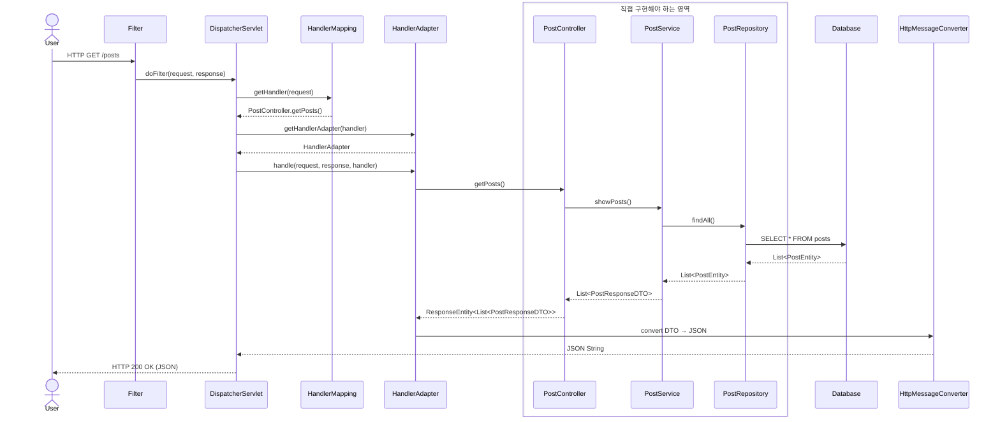
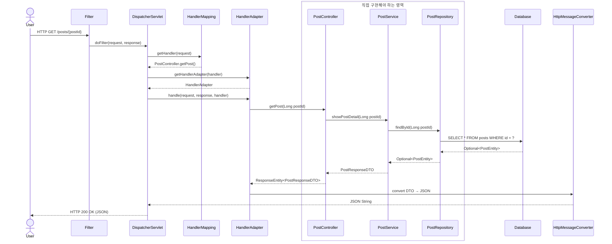
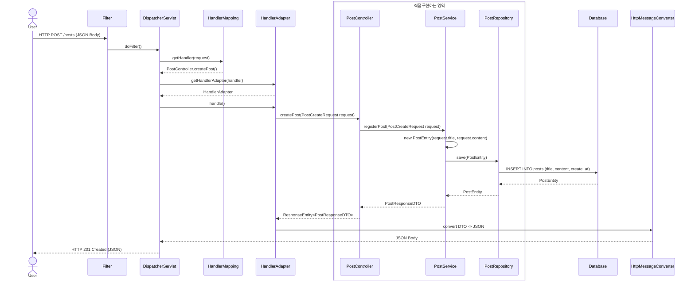
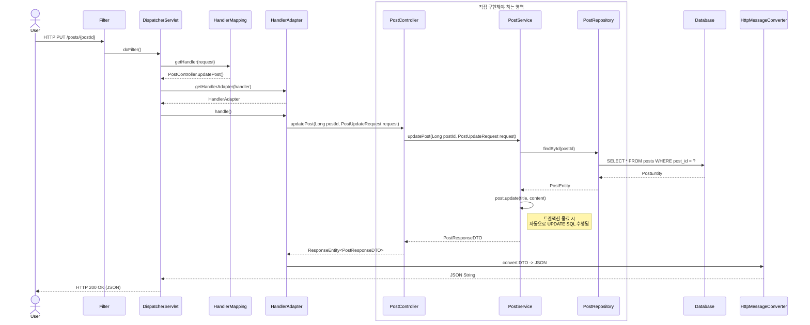
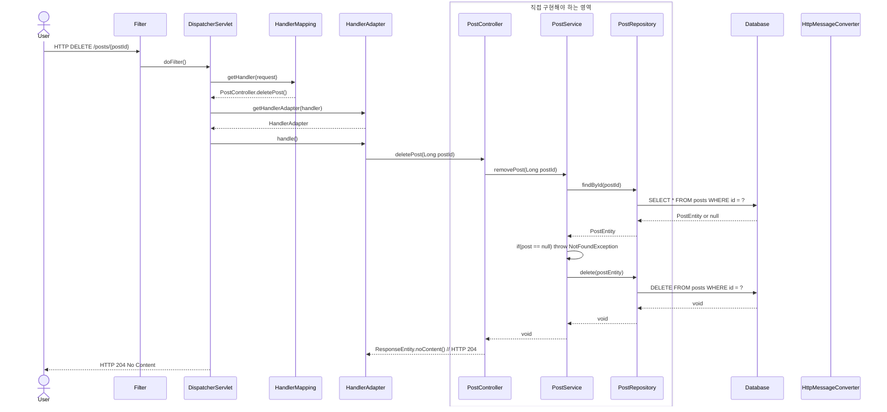

## 게시판 만들기 연습 (JSON)
원티드 포텐업 백엔드 1기 주말과제로 5개의 기능을 만들어 보기 위해서 만들었다.

해당 프로젝트는 MVC가 아닌 JSON으로 반환하는 RestController를 사용하여 구현한 프로젝트이다.
- HttpMessageConverter는 `@ResponseBody` 과 `@RequestBody`를 사용할 때 사용되는 인터페이스이다.
- `@RestController`내부에는 `@ResponseBody`Annotation이 존재하기 때문에 자동으로 HttpMessageConverter가 동작하게된다.
### Sequence Diagram
#### 1. 게시판 전체 조회

#### 2. 게시판 상세 조회

- 게시판 상세 조회는 `PathVariable({postId})`를 받아서 조회한다. 

#### 3. 게시판 생성

- `POST` 메서드를 사용하여 HTTP Body에서 post를 생성하는데 필요한 데이터(title, content)를 받는다.
- 받아온 데이터를 **Service 계층에서 post 인스턴스를 생성**한 후, DB에 저장한다.

#### 4. 게시판 업데이트

- `PUT` 메서드는 **전체를 변경**하는 것이고 `PATCH`는 **부분을 업데이트** 하는 것이다.
- 여기서는 전체를 수정하는 것을 가정하고 **`PUT`메서드를 사용**해서 업데이트를 한다.
- Dirty Checking으로 post를 따로 save를 해주지 않아도 된다. 
- Body없이 성공만 알릴 때는 `204 No Content`를 사용하는 것이 더 좋다고 한다.

#### 5. 게시판 삭제

- `DELETE` 메서드를 사용하고, 어떤 post를 삭제할지 `PathVariable(postId)`를 통해서 post id를 받아온다.
- 삭제하기 전에 해당 post가 있는지 확인하고 **없으면 Exception**을 발생시킨다.
- repository에서 delete메서드는 응답값이 없으므로 **status code를 204로 반환하여 삭제가 완료**되었음을 알린다.  
